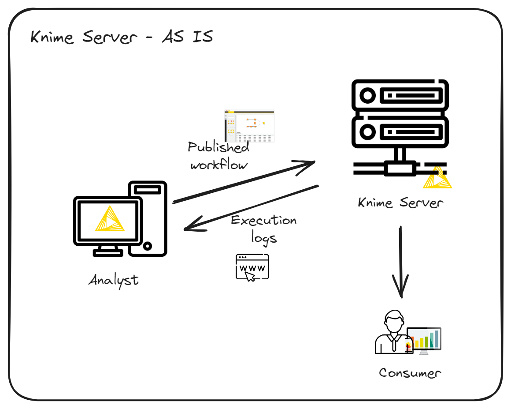
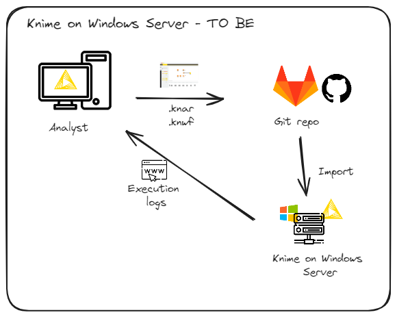
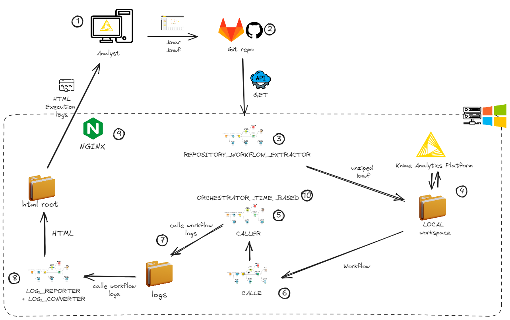

# Resources for management of a Knime Analytics Platform headless execution on a Windows Server

The idea here is to have a Knime Analytics Platform on a Windows Server performing some management activities, like:

1) Knime Analytics Platform version management
2) headless execution of Knime workflows
3) execution logs management
4) workflow scheduling

Yes, you can do these things and much more using Knime Community/Business Hub. But what about you can't pay for these tools ? For instance, here in Brazil, where 38% of work force [earn ~US$ 291/month](https://countryeconomy.com/national-minimum-wage/brazil), the [~US$ 40k of a yearly license of a Basic Knime Business Hub](https://www.knime.com/knime-hub-pricing) are prohibitive !

## AS IS scenario

How Knime Server works:

- The analyst develops the workflow in the Knime Analytics Platform on his/her local workstation
- The workflow is published and tested in the Knime Server Homologation environment (a homologation folder on Knime Server with specific permissions)
- The tested workflow is published in the Knime Server Production environment (a production folder on Knime Server with specific permissions)
- The analyst schedules and monitors the execution of the workflow while connected to the Knime Server
- Data apps are accessed by the end user in the Knime Server web interface

<picture>
 <source media="(prefers-color-scheme: dark)" srcset="images/knime_server_AS_IS_EN.png">
 <source media="(prefers-color-scheme: light)" srcset="images/knime_server_AS_IS_EN.png">
 
</picture>

## TO BE scenario

How the Knime Server on Windows works:

- The analyst develops the workflow in the Knime Analytics Platform on his/her local workstation
- The workflow is versioned for a git repository (Github, Gitlab)
- The versioned workflow is imported into Knime on the Windows server, in the environment (homologation or production) and in the folder indicated by the Analyst
- The workflow execution is scheduled following the configuration proposed by the Analyst
- The execution logs of the production environment are published in a web interface for consultation by the Analyst

<picture>
 <source media="(prefers-color-scheme: dark)" srcset="images/knime_server_TO_BE_EN.png">
 <source media="(prefers-color-scheme: light)" srcset="images/knime_server_TO_BE_EN.png">
 
</picture>

## Not supported

The following features are not supported in Knime on Windows:

- Execution of Data Apps
- Saving workflows with errors

What is currently not supported by Knime on Windows Server but could be implemented:

- Segregation of logs by environment (homologation and production)
- Notification of execution with errors by email

Now let's dive into the implementation details.

## Detailed processes

Below are the processes implemented in Knime on Windows Server:

[1 – Analyst produces the WF and publishes it on git repo](#1_-_analyst_produces_the_wf_and_publishes_it_on_git_repo)
2 – WFs from the main branch are available
3 – Import of WFs from the main branch and make them available in the local Knime workspace
4 – Knime Analytics Platform on Windows Server accesses the WFs
5 and 6 – Scheduled WFs are executed independently
7 – WF execution logs are stored
8 – Stored logs are converted to HTML
9 – Web server makes HTML log pages available
10 - Time based orchestrator

<picture>
 <source media="(prefers-color-scheme: dark)" srcset="images/knime_on_windows_how_things_work_EN.png">
 <source media="(prefers-color-scheme: light)" srcset="images/knime_on_windows_how_things_work_EN.png">
 
</picture>

## 1 – Analyst produces the WF and publishes it on git repo

In order for the workflow to be considered in the Knime execution process on Windows, some precautions must be followed by the developer:

### [Develop the workflow within the caller-caller model](develop_the_workflow_within_the_caller-caller_model)
### [Provide a scheduling and notification file](provide_a_scheduling_and_notification_file)
### [Publish the workflow and the notification scheduling file](publish_the_workflow_and_the_notification_scheduling_file)

## 2 – WFs from the main branch are available
## 3 – Import of WFs from the main branch and make them available in the local Knime workspace
## 4 – Knime Analytics Platform on Windows Server accesses the WFs
## 5 and 6 – Scheduled WFs are executed independently
## 7 – WF execution logs are stored
## 8 – Stored logs are converted to HTML
## 9 – Web server makes HTML log pages available
## 10 - Time based orchestrator