# Resources for management of a Knime Analytics Platform headless execution on a Windows Server

The idea here is to have a Knime Analytics Platform on a Windows Server performing some management activities, like:

1) Knime Analytics Platform version management
2) headless execution of Knime workflows
3) execution logs management
4) workflow scheduling

Yes, you can do these things and much more using Knime Community/Business Hub. But what about you can't pay for these tools ? For instance, here in Brazil, where 38% of work force [earn ~US$ 291/month](https://countryeconomy.com/national-minimum-wage/brazil), the [~US$ 40k of a yearly license of a Basic Knime Business Hub](https://www.knime.com/knime-hub-pricing) are prohibitive !

The proposed solution was implemented in a Brazilian company that uses Knime Analytics Platform with a focus on data integration, without using data apps or web services. The solution has been online since September 2024 and has remained online for more than 500 uninterrupted hours, without needing to be restarted !

Download the workflow [here] (workflow/_MANAGEMENT_20250122.knar)!

## AS IS scenario

How Knime Server works:

- The analyst develops the workflow in the Knime Analytics Platform on his/her local workstation
- The workflow is published and tested in the Knime Server Homologation environment (a homologation folder on Knime Server with specific permissions)
- The tested workflow is published in the Knime Server Production environment (a production folder on Knime Server with specific permissions)
- The analyst schedules and monitors the execution of the workflow while connected to the Knime Server
- Data apps are accessed by the end user in the Knime Server web interface

<picture>
 <source media="(prefers-color-scheme: dark)" srcset="images/knime_server_AS_IS_EN.png">
 <source media="(prefers-color-scheme: light)" srcset="images/knime_server_AS_IS_EN.png">
 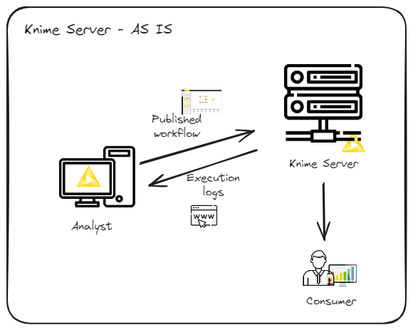
</picture>

## TO BE scenario

How the Knime Server on Windows works:

- The analyst develops the workflow in the Knime Analytics Platform on his/her local workstation
- The workflow is versioned for a git repository (Github, Gitlab)
- The versioned workflow is imported into Knime on the Windows server, in the environment (homologation or production) and in the folder indicated by the Analyst
- The workflow execution is scheduled following the configuration proposed by the Analyst
- The execution logs of the production environment are published in a web interface for consultation by the Analyst

<picture>
 <source media="(prefers-color-scheme: dark)" srcset="images/knime_server_TO_BE_EN.png">
 <source media="(prefers-color-scheme: light)" srcset="images/knime_server_TO_BE_EN.png">
 
</picture>

## Not supported

The following features are not supported in Knime on Windows:

- Execution of Data Apps
- Saving workflows with errors

What is currently not supported by Knime on Windows Server but could be implemented:

- Segregation of logs by environment (homologation and production)
- Notification of execution with errors by email

Now let's dive into the implementation details.

## Detailed processes

Below are the processes implemented in Knime on Windows Server:

[1 – Analyst produces the WF and publishes it on git repo](#1--analyst-produces-the-wf-and-publishes-it-on-git-repo)

[2 – WFs from the main branch are available](#2--wfs-from-the-main-branch-are-available)

[3 – Import of WFs from the main branch and make them available in the local Knime workspace](#3--import-of-wfs-from-the-main-branch-and-make-them-available-in-the-local-knime-workspace)

[4 – Knime Analytics Platform on Windows Server accesses the WFs](#4--knime-analytics-platform-on-windows-server-accesses-the-wfs)

[5 - CALLER – Scheduled WFs are executed independently](#5-caller--scheduled-wfs-are-executed-independently)

[6 - CALLE – Scheduled WFs are executed independently](#6-calle--scheduled-wfs-are-executed-independently)

[8 – Stored logs are converted to HTML](#8--stored-logs-are-converted-to-html)

[9 – Web server makes HTML log pages available](#9--web-server-makes-html-log-pages-available)

[10 - Time based orchestrator](#10---time-based-orchestrator)

<picture>
 <source media="(prefers-color-scheme: dark)" srcset="images/knime_on_windows_how_things_work_EN.png">
 <source media="(prefers-color-scheme: light)" srcset="images/knime_on_windows_how_things_work_EN.png">
 
</picture>

## 1 – Analyst produces the WF and publishes it on git repo

In order for the workflow to be considered in the Knime execution process on Windows, some precautions must be followed by the developer:

### Develop the workflow within the caller-caller model

The caller-caller execution model is adopted as part of the data science application lifecycle, presented by the company Knime as follows:

<picture>
 <source media="(prefers-color-scheme: dark)" srcset="images/knime_life_cicle.png">
 <source media="(prefers-color-scheme: light)" srcset="images/knime_life_cicle.png">
 
</picture>

The Knime Analytics Platform has a set of resources (nodes) classified as Workflow Services, aimed at deploying applications. The caller-caller model separates the content, the logic, from the executor:

**CALLE** - workflow specialized in implementing the business logic, that which needs to be executed
**CALLER** - workflow specialized in invoking other workflows, handling errors and documenting them

This model is also useful for development testing and for deploying applications in Knime Hub. See ["KNIME Workflow Invocation Guide"](https://docs.knime.com/latest/analytics_platform_workflow_invocation_guide/analytics_platform_workflow_invocation_guide.pdf) for more details.

To develop a workflow (call) that will later be invoked by the caller, the Analyst may adopt the following development template:

<picture>
 <source media="(prefers-color-scheme: dark)" srcset="images/calle_template.png">
 <source media="(prefers-color-scheme: light)" srcset="images/calle_template.png">
 
</picture>

The nodes that implement the business logic have to be positioned between and connected to the "Workflow Service Input" and "Workflow Service Output" nodes, as in the following example:

<picture>
 <source media="(prefers-color-scheme: dark)" srcset="images/calle_example.png">
 <source media="(prefers-color-scheme: light)" srcset="images/calle_example.png">
 
</picture>

### Provide a scheduling and notification file

After developing the calle workflow, the Analyst must create a text file in JSON format containing the execution instructions.

This file must have the same name as the .knar or .knwf file to be generated, followed by the .json extension, and its content must follow the following format:

```
{
  "workflow_name": "CAPELANIA/LISTAGEM_ANIVERSARIANTES_DO_MES_EXCEL",
  "workflow_path": "/",
  "workflow_schedule": {
      "daily":  [ 
                    {"hour": "12", "notify": "user1@domain.com;user2@domain.com"},
                    {"hour": "15", "notify": "user1@domain.com;user2@domain.com"}
                ],
      "weekly": [	{"day": "Wednesday",
                    "schedule": [
                                    { "hour": "07","notify": "user1@domain.com;user2@domain.com"},
                                    { "hour": "11","notify": "user1@domain.com;user2@domain.com"}
                                ]
                    },
                    {"day": "Friday",
                    "schedule": [
                                    { "hour": "08","notify": "user1@domain.com;user2@domain.com"},
                                    { "hour": "12","notify": "user1@domain.com;user2@domain.com"}
                                ]
                    }
                ],
      "monthly": [	{"day": "16",
                    "schedule": [
                                    { "hour": "06","notify": "user1@domain.com;user2@domain.com"},
                                    { "hour": "13","notify": "user1@domain.com;user2@domain.com"}
                            ]
                    },
                    {"day": "22",
                    "schedule":  [
                                    { "hour": "09","notify": "user1@domain.com;user2@domain.com"},
                                    { "hour": "16","notify": "user1@domain.com;user2@domain.com"}
                            ]
                    }
                ]
  }
} 
```

For the example above, the file containing the workflows is called CAPELANIA.knar, and the scheduling and notification file is called CAPELANIA.json .

The content of the .json file must be valid JSON and contain the following objects:

**1) workflow_name** - string containing the full path to the only workflow that will be executed at the scheduled time. It is assumed that the .knar file will contain the same structure informed in this workflow_name attribute. If more than one workflow must be executed, create a main workflow and inform the path to this main workflow. For example: the CAPELANA.knar file was generated containing the main folder (CAPELANIA) and within it two objects (data folder and workflow LISTAGEM_ANIVERSARIANTES_DO_MES_EXCEL):

<picture>
 <source media="(prefers-color-scheme: dark)" srcset="images/export_workflow.png">
 <source media="(prefers-color-scheme: light)" srcset="images/export_workflow.png">
 
</picture>

And when the file CAPELANIA.knar is imported into Knime, its structure will be [DESTINATION DIRECTORY]/CAPELANIA:

<picture>
 <source media="(prefers-color-scheme: dark)" srcset="images/destination_folder.png">
 <source media="(prefers-color-scheme: light)" srcset="images/destination_folder.png">
 
</picture>

The **workflow_name** object must contain the following value:

"workflow_name": "`CAPELANIA/LISTAGEM_ANIVERSARIANTES_DO_MES_EXCEL`"

**2) workflow_path** - for future use

**3) workflow_schedule** - an array of schedule objects: an array containing daily schedules, an array containing weekly schedules, and an array containing monthly schedules. 

For example, consider the array of the workflow_schedule object:

```
"workflow_schedule": {
      "daily":  [ 
                    {"hour": "12", "notify": "user1@domain.com;user2@domain.com"},
                    {"hour": "15", "notify": "user1@domain.com;user2@domain.com"}
                ],
      "weekly": [	{"day": "Wednesday",
                    "schedule": [
                                    { "hour": "07","notify": "user1@domain.com;user2@domain.com"},
                                    { "hour": "11","notify": "user1@domain.com;user2@domain.com"}
                                ]
                    },
                    {"day": "Friday",
                    "schedule": [
                                    { "hour": "08","notify": "user1@domain.com;user2@domain.com"},
                                    { "hour": "12","notify": "user1@domain.com;user2@domain.com"}
                                ]
                    }
                ],
      "monthly": [	{"day": "16",
                    "schedule": [
                                    { "hour": "06","notify": "user1@domain.com;user2@domain.com"},
                                    { "hour": "13","notify": "user1@domain.com;user2@domain.com"}
                            ]
                    },
                    {"day": "22",
                    "schedule":  [
                                    { "hour": "09","notify": "user1@domain.com;user2@domain.com"},
                                    { "hour": "16","notify": "user1@domain.com;user2@domain.com"}
                            ]
                    }
                ]
  }
```

In this example, the workflow will be executed:
- **daily**, at 12:00 and 15:00, and also
- **weekly**, on Wednesdays at 07:00 and 11:00 and on Fridays at 08:00 and 12:00, and also
- **monthly**, on the 16th, at 06:00 and 13:00 and on the 22nd, at 09:00 and 16:00

**IMPORTANT:**
- The times must be in the range 00 to 23, represented with two digits
- The days of the week must be written in English, with the first letter capitalized and the rest lowercase
- The days of the month must be in the range 01 to 31, represented with two digits

The **notify** property must contain the emails (one or more, separated by semicolons) of the people who should be notified when errors occur in the execution of the workflow. This functionality has not yet been implemented.

### Publish the workflow and the notification scheduling file

After developing the workflow and creating the scheduling and notification file, the Analyst must:

1) Export the workflow or the folder containing the workflows and subfolders

The content of what was developed in the Knime Analytics Platform must be exported, generating either a .knar or a .knwf file.

If the project contains subdirectories/subfolders and/or other workflows, the export must contain these subdirectories and/or workflows:

<picture>
 <source media="(prefers-color-scheme: dark)" srcset="images/export_workflow2.png">
 <source media="(prefers-color-scheme: light)" srcset="images/export_workflow2.png">
 
</picture>

<picture>
 <source media="(prefers-color-scheme: dark)" srcset="images/export_workflow21.png">
 <source media="(prefers-color-scheme: light)" srcset="images/export_workflow21.png">
 
</picture>

2) Publish the .knar or .knwf file and the scheduling and notification file to a new git branch and commit.

The files should be published as a new branch of the main branch of the Knime project, in git repo account, as in the example below:

<picture>
 <source media="(prefers-color-scheme: dark)" srcset="images/git_repo.png">
 <source media="(prefers-color-scheme: light)" srcset="images/git_repo.png">
 
</picture>

IMPORTANT: only files from the main branch will be considered in the import process.

## 2 – WFs from the main branch are available

The workflows considered for import into Knime for Windows are those in the main branch of the Knime project on git account.

## 3 – Import of WFs from the main branch and make them available in the local Knime workspace

The REPOSITORY_WORKFLOW_EXTRACTOR process is responsible for executing the following tasks:

### 1) Reading the files from the main branch of the Knime project from Gitlab

Excerpt from the REPOSITORY_WORKFLOW_EXTRACTOR workflow responsible for the task:

<picture>
 <source media="(prefers-color-scheme: dark)" srcset="images/3_1_1.png">
 <source media="(prefers-color-scheme: light)" srcset="images/3_1_1.png">
 
</picture>

Files published to the main branch of the Knime project on git repo are uploaded to a temporary folder in the project dataspace on the Knime Analytics Platform on Windows Server (`[knime workspace]/[environment]/CALL/data/[temp folder]`). Afterwards, only files with the extensions .knar, .knwf and .json will be considered.

<picture>
 <source media="(prefers-color-scheme: dark)" srcset="images/3_1_2.png">
 <source media="(prefers-color-scheme: light)" srcset="images/3_1_2.png">
 
</picture>

### 2) Comparing the workflows read from Gitlab with those that have already been loaded

Excerpt from the REPOSITORY_WORKFLOW_EXTRACTOR workflow responsible for the task:

<picture>
 <source media="(prefers-color-scheme: dark)" srcset="images/3_2_1.png">
 <source media="(prefers-color-scheme: light)" srcset="images/3_2_1.png">
 
</picture>

Files downloaded from git repo and uploaded to the temporary folder are compared with those that have already been uploaded in previous runs (`[knime workspace]/[environment]/IMPORTED_WORKFLOWS`). The comparison criteria considered are: **file name** and **file size**. If a file with the same name and size already exists, the conclusion is that there were no changes to the content of that file, and there is no need to upload it again.

<picture>
 <source media="(prefers-color-scheme: dark)" srcset="images/3_2_2.png">
 <source media="(prefers-color-scheme: light)" srcset="images/3_2_2.png">
 
</picture>

### 3) Publishing the current and new workflows

Excerpt from the REPOSITORY_WORKFLOW_EXTRACTOR workflow responsible for the task:

<picture>
 <source media="(prefers-color-scheme: dark)" srcset="images/3_3_1.png">
 <source media="(prefers-color-scheme: light)" srcset="images/3_3_1.png">
 
</picture>

In this step, for each .knar or .knwf file considered, the following actions occur:

- The downloaded file (.knar or .knwf) is copied to the imported worfklows folder (`[knime workspace]/[environment]/IMPORTED_WORKFLOWS`)

<picture>
 <source media="(prefers-color-scheme: dark)" srcset="images/3_3_2.png">
 <source media="(prefers-color-scheme: light)" srcset="images/3_3_2.png">
 
</picture>

- The current version of the workflow with the same name is compressed and copied to a backup folder (`/KNIME_WORKFLOW_BACKUP/[environment]`). If a previous version of the workflow does not exist, compression fails.

<picture>
 <source media="(prefers-color-scheme: dark)" srcset="images/3_3_3.png">
 <source media="(prefers-color-scheme: light)" srcset="images/3_3_3.png">
 
</picture>

<picture>
 <source media="(prefers-color-scheme: dark)" srcset="images/3_3_4.png">
 <source media="(prefers-color-scheme: light)" srcset="images/3_3_4.png">
 
</picture>

- The .knar or .knwf file is unpacked into the environment workspace (`[knime workspace]/[environment]`)

<picture>
 <source media="(prefers-color-scheme: dark)" srcset="images/3_3_5.png">
 <source media="(prefers-color-scheme: light)" srcset="images/3_3_5.png">
 
</picture>

### 4) Scheduling the execution of the workflows

Excerpt from the REPOSITORY_WORKFLOW_EXTRACTOR workflow responsible for the task:

<picture>
 <source media="(prefers-color-scheme: dark)" srcset="images/3_4_1.png">
 <source media="(prefers-color-scheme: light)" srcset="images/3_4_1.png">
 
</picture>

In this step, for each .knar or .knwf file considered, the following actions occur:

- The .JSON file with the same name as the .knwf or .knar file is read
- The workflow execution is scheduled based on the content of the .JSON file
- A log entry is generated

## 4 – Knime Analytics Platform on Windows Server accesses the WFs

The workflow executor is, in fact, an instance of Knime Analytics Platform, configured with the necessary extensions to execute the workflows.

In this topic, some points are worth highlighting:

### 1) Executor version

Keeping the Knime Analytics Platform executor up to date is a necessity, since Analysts tend to develop their workflows in the most current version. Visit Knime [site](https://www.knime.com/downloads) to check the current version of Knime Analytics Platform.

In Knime Analytics Platform on Windows Server, the versions are kept in separate directories. The most current version is accessed by a shortcut, so that the instruction to execute Knime will always be the same. Creating the shortcut is detailed below.

<picture>
 <source media="(prefers-color-scheme: dark)" srcset="images/4_1.png">
 <source media="(prefers-color-scheme: light)" srcset="images/4_1.png">
 
</picture>

In the image above, there are two versions of Knime Analytics Platform installed in separate directories. The KNIME directory is a shortcut to the most current version of Knime.

### 2) Shortcut to the latest version of Knime

The creation of the shortcut to the latest version of Knime Analytics Platform was implemented with the mklink command, as in the following command:

`mklink /D C:\APPLICATIONS\KNIME\KNIME C:\APPLICATIONS\KNIME\knime_5.2.5`

### 3) Workspace and environments

The Knime Analytics Platform workspace on Windows Server was mounted on a separate disk from the server's main disk. Below the workspace root are the environment folders (HOMOLOGATION and PRODUCTION).

**IMPORTANT:** the workflow import process will always import to the PRODUCTION environment.

### 4) Other important directories

The support directories of the workflows that are shared between the environments will be located at the same level as the workspace.

<picture>
 <source media="(prefers-color-scheme: dark)" srcset="images/4_2.png">
 <source media="(prefers-color-scheme: light)" srcset="images/4_2.png">
 
</picture>

## 5 CALLER – Scheduled WFs are executed independently

Excerpt from the WORKFLOW_TRIGGER workflow responsible for the task:

<picture>
 <source media="(prefers-color-scheme: dark)" srcset="images/5_1.png">
 <source media="(prefers-color-scheme: light)" srcset="images/5_1.png">
 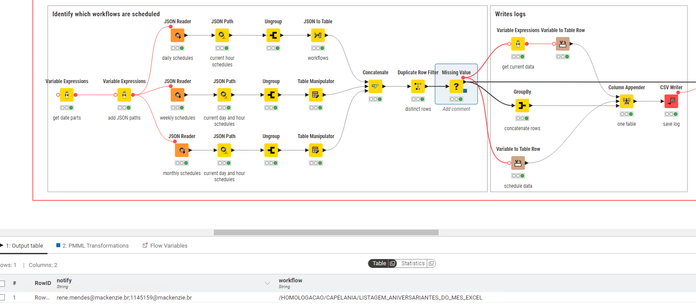
</picture>

The workflows must be executed in the order specified in the scheduling files. To do this, the WORKFLOW_TRIGGER workflow is executed every hour.

In this step of the process, the daily (daily.json), weekly (weekly.json) and monthly (monthly.json) scheduling files are read from the environment's scheduling directory (`[knime workspace]/[environment]/SCHEDULES`) and searched for the current time, day of the week and day of the month.

In the example above, the process found a schedule for the current time within the files. Here are examples of the scheduling files:

**daily.json**

<picture>
 <source media="(prefers-color-scheme: dark)" srcset="images/5_2.png">
 <source media="(prefers-color-scheme: light)" srcset="images/5_2.png">
 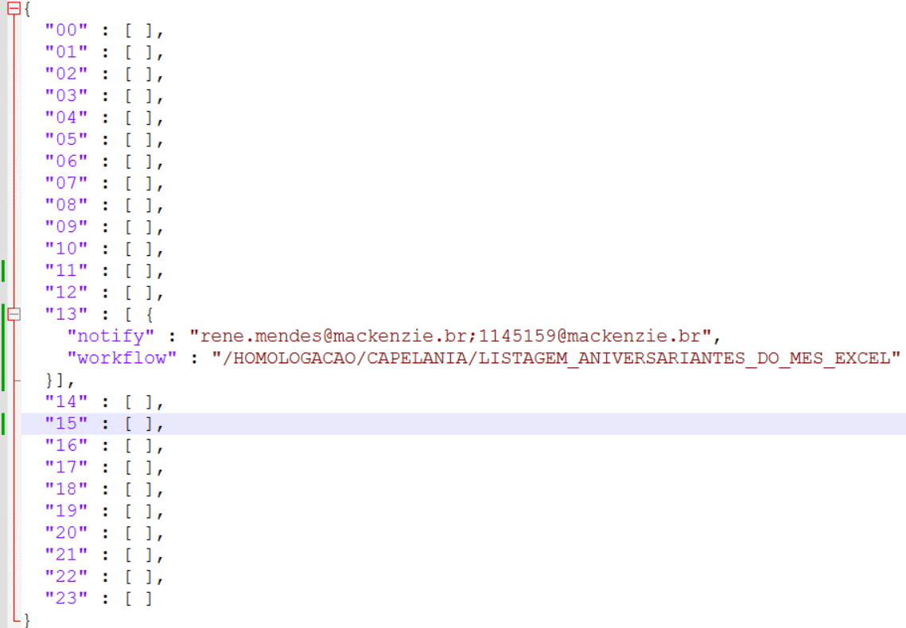
</picture>

**weekly.json**

<picture>
 <source media="(prefers-color-scheme: dark)" srcset="images/5_3.png">
 <source media="(prefers-color-scheme: light)" srcset="images/5_3.png">
 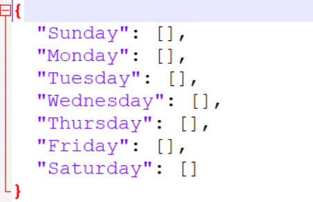
</picture>

**monthly.json**

<picture>
 <source media="(prefers-color-scheme: dark)" srcset="images/5_4.png">
 <source media="(prefers-color-scheme: light)" srcset="images/5_4.png">
 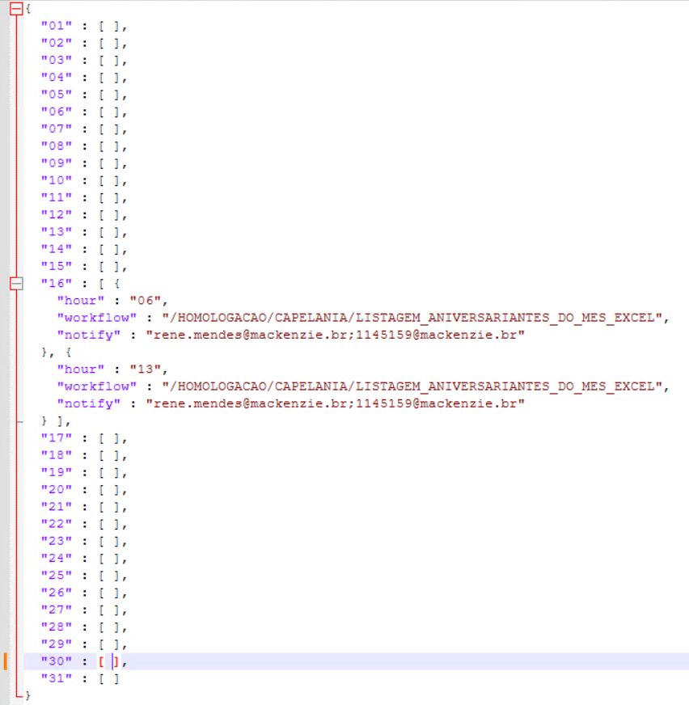
</picture>

After finding processes to run within the current time, the process logs the current time, day, and day of the week, and the path to each workflow found in the search. The logs are written to the file `[knime workspace]/[environment]/SCHEDULE_LOG/[yyyy-mm-dd].log`.

## 6 CALLE – Scheduled WFs are executed independently

Excerpt from the WORKFLOW_TRIGGER workflow responsible for the task:

<picture>
 <source media="(prefers-color-scheme: dark)" srcset="images/6_1.png">
 <source media="(prefers-color-scheme: light)" srcset="images/6_1.png">
 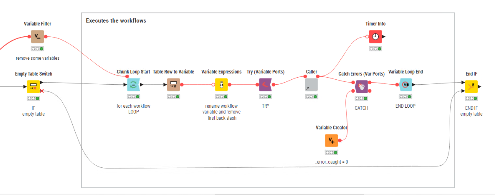
</picture>

In this step of the process, each workflow found in the scheduling files is executed within a TRY-CATCH block and the execution logs are generated.

For execution, a specialist component called CALLER is invoked, receiving as an argument the path of the workflow to be executed. The structure of the CALLER is:

<picture>
 <source media="(prefers-color-scheme: dark)" srcset="images/6_2.png">
 <source media="(prefers-color-scheme: light)" srcset="images/6_2.png">
 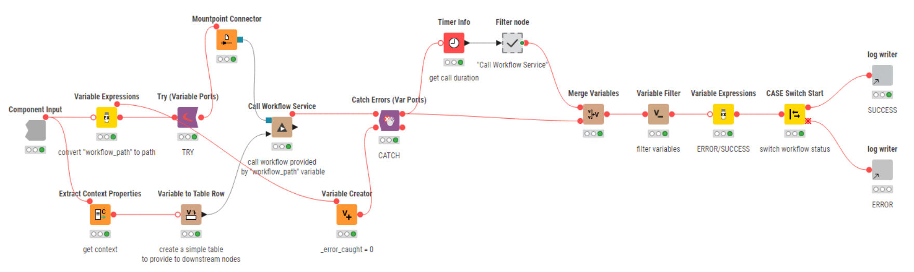
</picture>

In this component, the workflow to be executed, or CALLE, is invoked by the "Call Workflow Service" node. If the execution fails, the exception is collected and logged. A successful execution is also logged. The logs are stored in the pattern `[knime workspace]/[environment]/LOG/[yyyy-mm-dd].log` .

## 8 – Stored logs are converted to HTML

Workflow LOG_REPORTER, responsible for the task:

<picture>
 <source media="(prefers-color-scheme: dark)" srcset="images/8_1.png">
 <source media="(prefers-color-scheme: light)" srcset="images/8_1.png">
 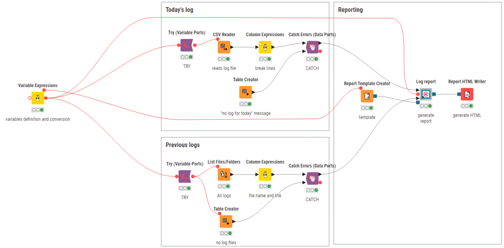
</picture>

In this step, the current day's log file, stored in the path `[knime workspace]/[environment]/LOG/[yyyy-mm-dd].log`, is converted to a report and saved as an HTML page, stored in the path `/KNIME_HTML_LOGS/index.html`.

For each log from the previous day, a link is added to the index.html file.

The previous day's report also needs to be converted to HTML, which is performed by the LOG_CONVERTER workflow.

## 9 – Web server makes HTML log pages available

The HTML pages are made available to analysts via the NGINX web server.

The report looks like this:

<picture>
 <source media="(prefers-color-scheme: dark)" srcset="images/9_1.png">
 <source media="(prefers-color-scheme: light)" srcset="images/9_1.png">
 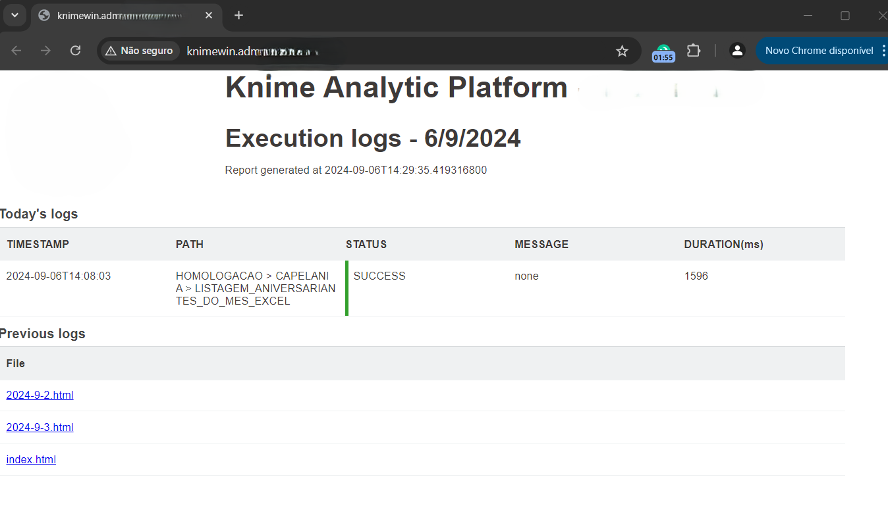
</picture>

## 10 - Time based orchestrator

The process that executes the scheduled workflows, described in this link, is called by means of a workflow orchestrator, programmed to execute a set of workflows at previously determined time intervals.

The workflow orchestrator is ORCHERSTRATOR_TIME_BASED and its logic is quite simple:

<picture>
 <source media="(prefers-color-scheme: dark)" srcset="images/10_1.png">
 <source media="(prefers-color-scheme: light)" srcset="images/10_1.png">
 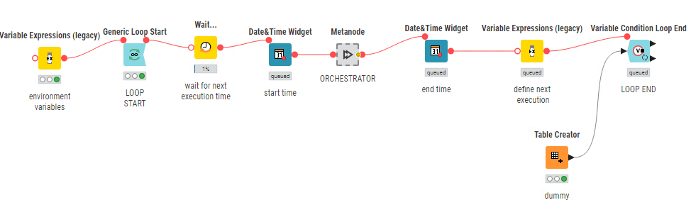
</picture>

The workflow executes, in an infinite loop, a node that waits for the arrival of a time defined in the previous iteration. When the defined time arrives, a metanode is executed, collecting the start and end times of the execution. The metanode is composed of the following nodes:

<picture>
 <source media="(prefers-color-scheme: dark)" srcset="images/10_2.png">
 <source media="(prefers-color-scheme: light)" srcset="images/10_2.png">
 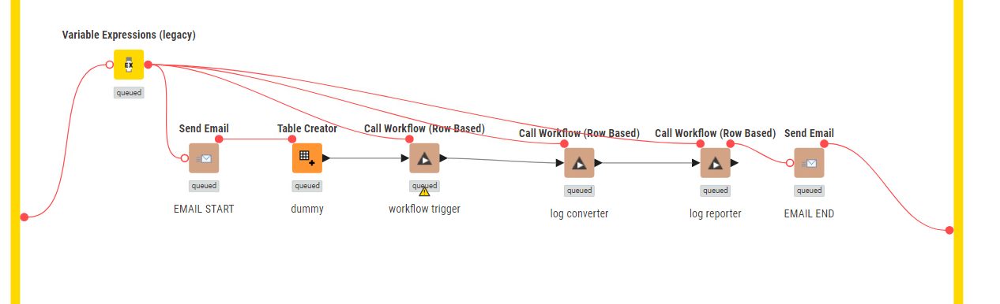
</picture>

The actions contained in the metanode are logically chained:
- An email is sent informing the start of the execution
- Three nodes are called in sequence:
    - Workflow trigger
    - Log converter
    - Log reporter
- An email is sent informing the end of the execution.

## Implementation information

Knime Analytics Platform version: 5.4

## Final remarks

Yes, the ideal is to have Knime Hub. However, in scenarios that only require scheduled execution of workflows with control over the results, the proposed solution meets the need.